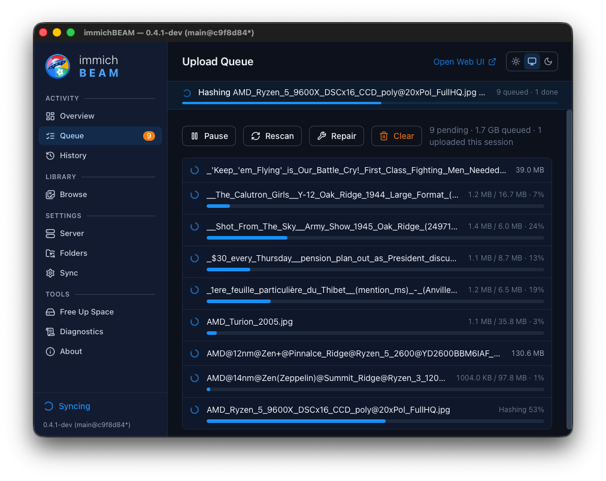
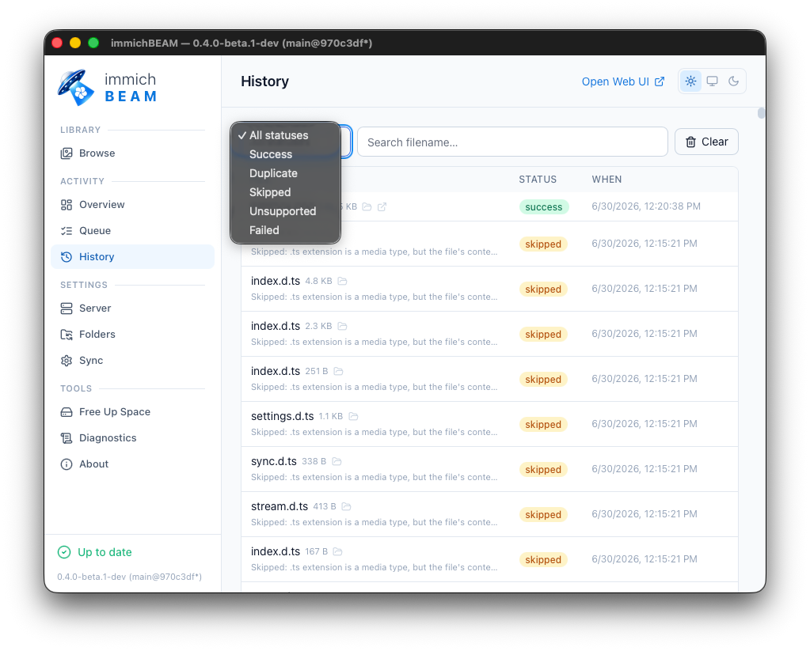
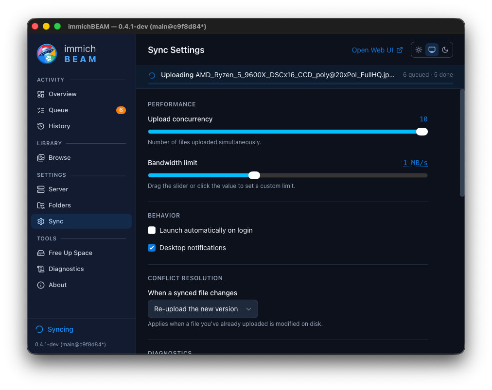

<p align="center">
  
</p>

<!-- immichBEAM — immich BEAM -->

<p align="center">
  A secure, cross-platform desktop media sync client for your private <a href="https://immich.app">Immich</a> server(s).<br/>
  Resides in the system tray, watches folders, and allows you to search, browse, and manage your remote photo and video library.
</p>

<p align="center">
  
  
</p>

---

<p align="center">
  <a href="#about">About</a> &middot;
  <a href="#screenshots">Screenshots</a> &middot;
  <a href="#features">Features</a> &middot;
  <a href="#install">Install</a> &middot;
  <a href="#getting-started">Getting started</a> &middot;
  <a href="#build-from-source">Build from source</a> &middot;
  <a href="#tech-stack">Tech stack</a> &middot;
  <a href="#testing-status">Testing</a> &middot;
  <a href="#roadmap">Roadmap</a>
</p>

---

<p align="center">
  
</p>

## About

immichBEAM sits in your system tray and keeps your photos and videos backed up to your self-hosted [Immich](https://immich.app) server. Think Google Drive or Dropbox, but for your photo library.

- **Watch folders** and automatically upload new photos and videos
- **Browse your entire Immich library** — timeline, albums, people, places, and map
- **Smart search** with CLIP semantic search ("sunset at the beach")
- **System tray** with live status, pause/resume, and quick actions
- **Cross-platform** — macOS, Windows, and Linux

This is the third iteration of building an Immich desktop client. The initial use case was a simple Windows app easy enough for my wife or mom to use. Then I realized 30% of my MacBook drive was filled with old photos and videos, so I decided to make it cross-platform. And it has spiraled from there.

Built almost entirely with AI coding agents: initial design and architecture with Claude (Fable 5), core development with Claude (Opus 4.6), some work with Codex (GPT-5.4) and OpenCode (GLM 5.2). Graphics created with Gab.ai, Gemini, and GIMP.

**Help wanted:** If you're running Linux or ARM hardware, testing and bug reports are especially valuable. Open an issue with your platform, Immich server version, and what broke. The app has a built-in log viewer (Settings > Logs) with level filtering and export — attach debug logs to your issue for faster diagnosis.

## Screenshots

<table>
  <tr>
    <td><br/><sub>Browse your library with filters, search, and smart search</sub></td>
    <td><br/><sub>Full photo viewer with EXIF, GPS, download, and local path</sub></td>
  </tr>
  <tr>
    <td><br/><sub>Watch folders with per-folder album assignment</sub></td>
    <td><br/><sub>API key or email/password auth with certificate pinning</sub></td>
  </tr>
  <tr>
    <td><br/><sub>Map view with clustered markers and hover previews</sub></td>
    <td align="center"><br/><sub>System tray with live status and quick actions</sub></td>
  </tr>
  <tr>
    <td><br/><sub>Live upload queue with progress, retries, and bandwidth control</sub></td>
    <td><br/><sub>Upload history with status filtering and per-file details</sub></td>
  </tr>
  <tr>
    <td><br/><sub>Sync settings with bandwidth limits and watcher tuning</sub></td>
    <td></td>
  </tr>
</table>

## Features

### Sync engine
- Recursive folder watching with debounced filesystem events
- SHA1 content hashing with an SQLite cache — only new/changed files are processed
- Server-side duplicate detection before upload
- Durable upload queue that survives restarts, with retries and exponential backoff
- Configurable upload concurrency and bandwidth throttling (global limit shared across all concurrent uploads)
- Streaming uploads with live per-file progress
- Live Photo pairing (still + video linked automatically)
- XMP sidecar support

### Library browser
- **Timeline** — infinite-scroll grid of your entire library
- **Albums** — browse, open, and filter album contents
- **People** — recognized faces; click to see their photos
- **Places** — browse by city
- **Map** — clustered markers with hover previews on a theme-aware map
- **Search** — filename search, quick filters (favorites, archive, not-in-album), tag filtering, and date ranges
- **Smart search** — CLIP semantic search when machine learning is enabled on the server
- **Lightbox** — full viewer with EXIF metadata, GPS coordinates, camera info, download, and local file path with Reveal in Finder

### Organization
- Per-folder album assignment (manual, by device name, or by folder name)
- Create albums and reorganize previously-uploaded assets
- Tag-based filtering with multi-select combobox

### Security
- Credentials stored in the OS keychain (macOS Keychain, Windows Credential Manager, Linux Secret Service) — never written to disk
- Trust-on-first-use **certificate pinning** for self-signed servers
- Least-privilege IPC capabilities
- Content Security Policy enforced

### Desktop integration
- System tray with connection-aware status icons and live queue depth
- Minimize-to-tray on close
- Launch on login
- Single-instance (second launch focuses the existing window)
- Light, dark, and system theme
- **Free Up Space** — safely trash local files already backed up (verified by checksum)
- Log viewer with level/category filtering and export

## Install

Download the latest release for your platform from [GitHub Releases](https://github.com/nickdwhite/immichBEAM/releases):

| Platform | Format |
|----------|--------|
| macOS | `.dmg` (universal) |
| Windows | `.msi` or `.exe` (NSIS) |
| Linux | `.deb` or `.AppImage` |

## Getting started

1. Launch immichBEAM — it appears in your system tray
2. Open the dashboard (click the tray icon or select **Open Dashboard**)
3. Go to **Server** — enter your Immich server URL and authenticate with an API key or email/password
4. Go to **Folders** — add folders to watch
5. Your photos start syncing automatically — monitor progress in **Overview** or **Queue**

## Build from source

### Prerequisites

- [Rust](https://rustup.rs/) (stable) and your platform's [Tauri dependencies](https://tauri.app/start/prerequisites/)
- Node 18+ and [pnpm](https://pnpm.io/)
- Linux: `libsecret-1-dev` (Debian/Ubuntu) for keychain support

### Development

```bash
pnpm install
pnpm tauri dev
```

### Build installers

```bash
pnpm tauri build
```

## Tech stack

| Layer | Technology |
|-------|-----------|
| Framework | [Tauri 2](https://tauri.app) |
| Frontend | React 19, TypeScript, Tailwind CSS |
| Backend | Rust (tokio, reqwest, rusqlite) |
| Database | SQLite with WAL mode and connection pooling |
| File watching | [notify](https://docs.rs/notify) with debouncing |

## Immich compatibility

Tested with Immich v2.x. Includes forward-compatibility shims for upcoming v3 API changes (visibility enum, duration format, search fields).

## Testing status

| Platform | Status | Notes |
|----------|--------|-------|
| macOS (Intel) | Moderate testing | Primary dev machine |
| macOS (Apple Silicon) | Builds via universal binary | Needs real-world testing |
| Windows 10/11 (x64) | Moderate testing | Working well |
| Windows (ARM) | CI builds | Untested — testers welcome |
| Ubuntu 24.04+ (x64) | CI builds | Light testing — needs more |
| Ubuntu (ARM) | CI builds | Untested — testers welcome |

## Roadmap

These are planned features beyond the current release:

- **Local media browser** — browse and view files in your watched folders directly
- **Simple mode** — streamlined UI for non-technical users
- **Permission scoping** — detect Immich user/API key permissions and only expose available features
- **Inline editing** — rename albums, assign tags, rename people, edit location from the browse interface
- **Enhanced disk cleanup** — expanded local file management and utilities
- **Admin installer bundles** — pre-configured installers with scoped features for deployment
- **Multi-server support** — connect multiple Immich servers and assign folders per server
- **Immich v3 API** — full compatibility with auto-detection of server version

## License

[WTFPL](http://www.wtfpl.net/) — Do What The Fuck You Want To Public License.
